  
   
   
  
  

 

> [!NOTE]
> **Open to collaboration.** I’m interested in useful web products, community platforms, developer tools, and game projects.

## A quick introduction

I’m **Manish**, the founder of **StupidGames-MC**. I build for the web and for the communities that form around it—whether that is a smooth website, a bot that removes busywork, or a Minecraft feature players want to come back to.

The best work feels simple on the surface. Behind it, I care about good structure, clear decisions, and the small details that make a product feel complete.

<table>
  <tr>
    <td width="50%" valign="top">
      <h3>01 / Web products</h3>
      
Full-stack features and interfaces that are clear, responsive, and enjoyable to use.

    </td>
    <td width="50%" valign="top">
      <h3>02 / Connected tools</h3>
      
APIs and small services that help products, communities, and teams work together.

    </td>
  </tr>
  <tr>
    <td width="50%" valign="top">
      <h3>03 / Community tools</h3>
      
Discord bots and useful automation that make running a community easier.

    </td>
    <td width="50%" valign="top">
      <h3>04 / Game experiences</h3>
      
Minecraft server systems built with both players and server teams in mind.

    </td>
  </tr>
</table>

## The way I build

| Start simple | Respect the details | Keep it quick | Build for people |
| :---: | :---: | :---: | :---: |
| Easy to understand | Polished, not noisy | Fast and reliable | Useful from day one |

I enjoy owning a project from the first idea to the shipped result. That means asking what people actually need, making the experience feel natural, and leaving the code in a good place for the next improvement.

## In progress

<table>
  <tr>
    <td width="33%" valign="top">
      <strong>Community</strong> 
      Better tools that give online communities more room to grow.
    </td>
    <td width="33%" valign="top">
      <strong>Product</strong> 
      Small improvements that make web products feel polished.
    </td>
    <td width="33%" valign="top">
      <strong>Play</strong> 
      Fresh ideas for Minecraft players and server teams.
    </td>
  </tr>
</table>

## Let’s make something people remember

Have an idea that needs a thoughtful builder? I’d be glad to hear it. The quickest way to reach me is through [GitHub](https://github.com/stupidladkaa) or [Discord](https://discord.com/users/922359954025885737).

   
  Made with care. Shipped with purpose.

