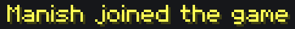
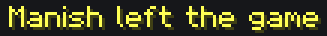

I run [StupidGames](https://github.com/StupidGames-MC), a small games studio in Nepal. Right now that means Minecraft events: I build the game modes, the Discord bots that run them, and whatever web the whole thing needs.

Most of it lives in private repos, so this profile looks quieter than my week does.

**Stack, roughly.** Next.js and Supabase for anything with a browser. Discord bots for anything with a community. Server systems and configs on the Minecraft side. I care about how things feel to use, probably more than is reasonable.

**Talk to me if**

- you want to play in an event, or run one with us
- you need a website, a Discord bot or a Minecraft system, and want someone who has built all three
- you're making games in Nepal and want to compare notes

Discord is fastest: [stupidladkaa](https://discord.com/users/922359954025885737). Otherwise [stupidladkaa67@gmail.com](mailto:stupidladkaa67@gmail.com).

 

